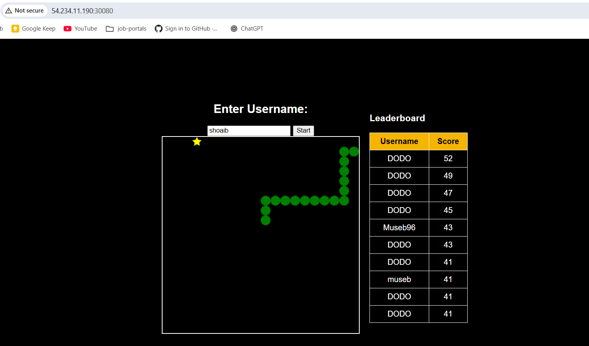

🐍 Snake Game on Kubernetes

🎮 A classic Snake Game with a modern twist:

Frontend built with HTML5 + JavaScript, served by Nginx

Backend written in PHP (Apache), connected to AWS RDS (MySQL)

Deployed on AWS EKS (Kubernetes) with proper Services, Secrets, and ConfigMaps

Includes Leaderboard to store player scores

📸 Screenshots

🕹️ Game UI

📊 Leaderboard
(add screenshot here)

📂 Project Structure
.
├── frontend/                  
│   ├── index.html             
│   ├── game.js               
│   ├── Dockerfile
│   └── frontend-deployment.yml svc.yml

│
├── backend/                   
│   ├── get_scores.php
│   ├── submit_score.php
│   ├── Dockerfile
│   ├── backend-deployment.yml
│   └── backend-svc.yml                      
│   ├── mysql-secret.yml       
│   ├── mysql-config.yml       
└── README.md

🚀 Features

✅ Play Snake in the browser
✅ Submit scores → saved in MySQL RDS
✅ Leaderboard showing Top 10 Players
✅ Kubernetes-native deployment (frontend + backend)
✅ Secrets & ConfigMaps for DB credentials and configs
✅ Scalable backend with replicas

⚙️ Deployment Guide
1️⃣ Clone Repository
git clone https://github.com/<your-username>/snakegame-k8s.git
cd snakegame-k8s

2️⃣ Build & Push Images

Frontend:

cd frontend
docker build -t <dockerhub-username>/snake-frontend .
docker push <dockerhub-username>/snake-frontend

Backend:

cd backend
docker build -t <dockerhub-username>/snake-backend .
docker push <dockerhub-username>/snake-backend

3️⃣ Setup MySQL (RDS)
 execute db-setup.sql file 
4️⃣ Deploy on Kubernetes
kubectl apply -f k8s/mysql-secret.yml
kubectl apply -f k8s/mysql-config.yml
kubectl apply -f backend/backend-deployment.yml
kubectl apply -f backend/backend-svc.yml
kubectl apply -f frontend/frontend-deployment.yml

5️⃣ Access Game

NodePort:

http://<node-public-ip>:<nodePort>

Ingress + ALB (recommended):

http://snakegame.example.com

📊 Monitoring (Optional)

Deploy Prometheus + Grafana for node/pod monitoring:

helm repo add prometheus-community https://prometheus-community.github.io/helm-charts
helm install prometheus prometheus-community/kube-prometheus-stack -n monitoring

Grafana dashboards available → Kubernetes Nodes, Pods, Cluster

🎯 Future Improvements

🔒 Add HTTPS with AWS ACM + Ingress

⚡ CI/CD pipeline with GitHub Actions or Jenkins

📈 Horizontal Pod Autoscaler (HPA) for backend scaling

🧑‍🤝‍🧑 User authentication system

✨ Credits

Built with ❤️ using HTML, JS, PHP, MySQL, Docker, Kubernetes, AWS

For learning Cloud + DevOps in a fun way 🎮
